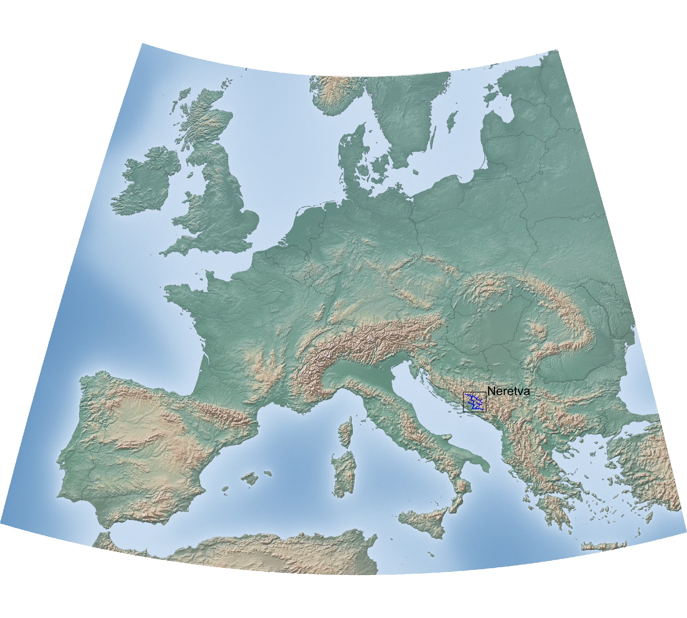

## Flee group river networks

Here you will find information on the river networks we work in. Click on a network on the maps below to get more information on what we do in each network, and to download data.

  
  

